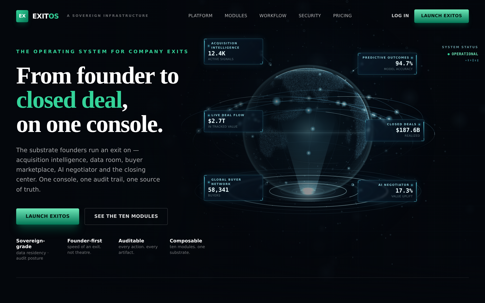

# Intelligence Globe

A reusable, **dependency-free** holographic "intelligence command core" hero
visual — a living global intelligence network rendered in real time. Built for
the ExitOS / Sovereign hero, extracted here as a portable design asset.

> Visual target: *"a global intelligence map made from light"* — Palantir
> Gotham / Anduril Lattice / a 2036 Bloomberg terminal. Not a marketing globe.



## What it is

A single React component, `IntelligenceGlobe`, that paints everything in real
time on one `<canvas>` and overlays HUD data panels as DOM. No WebGL, no 3D
libraries, no canvas libraries.

### Render layers (back → front)
- Background telemetry grid + far particle dust + distant blinking lights
- Atmospheric volumetric glow + bloom (depth)
- 3D orbital rings (depth-shaded) with nodes that pass in front of and behind
- The **particle globe** — continents emerge from *particle density alone*
  (no outlines/strokes), low-contrast, embedded in the data field
- Surface intelligence nodes (pulsing) + holographic scan sweep
- ~320 micro-telemetry markers + panel connectors with traveling signal packets
- Foreground bokeh particles
- A holographic **projection reactor** beneath: vertical light beam + multi-ring
  command platform with counter-rotating scan bands

### HUD panels
Six (configurable) translucent glass data panels — border, blur, glow, corner
ticks, status dot, mono value — wired to the globe by hairline connectors that
stream light packets into the core.

## Requirements
- **React 18+**
- **Tailwind CSS** (the DOM panels use utility classes + the `cyan-*` palette).
  If your project lacks Tailwind, port the panel classes to plain CSS.

## Usage
```tsx
import IntelligenceGlobe from "./src/IntelligenceGlobe";

export default function Hero() {
  return (
    <div className="relative h-screen w-full overflow-hidden bg-[#04070c]">
      <IntelligenceGlobe className="absolute inset-0" />
      {/* your headline / CTAs sit above, e.g. left column */}
    </div>
  );
}
```

## Customizing
All knobs live at the top of `src/IntelligenceGlobe.tsx`:

| What | Where |
|---|---|
| Data readouts (titles/values/positions) | `PANELS` array |
| Globe centre / vertical position | `GLOBE_CX`, `GLOBE_CY` |
| Globe size | `const R = Math.min(w, h) * 0.205` in `draw()` |
| Point-cloud density | `count` in `resize()` (capped for perf) |
| Land legibility | land particle multiplier in `buildSphere()` |
| Orbit count / tilt / speed | `RINGS` array |
| Platform rings / scan bands | the projection-reactor block in `draw()` |

## Behaviour notes
- Honors `prefers-reduced-motion` — renders a single static frame.
- The whole canvas scene is `aria-hidden` decoration; keep real copy in DOM.
- Rescales via `ResizeObserver`; HUD panels hide below the `lg` breakpoint so
  the hero stays clean on mobile.
- Continents are defined by **density**, never outlines — the deliberate design
  choice that keeps it reading as intelligence/telemetry rather than a map.

## Provenance
Extracted from `services/exit-web/src/components/GlobeScene.tsx`. Keep the two
in sync manually if you change one — this is a snapshot for future reuse.
